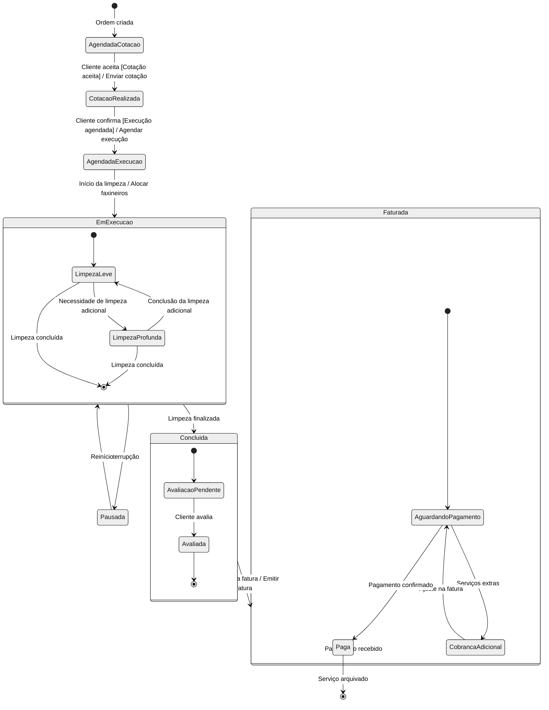
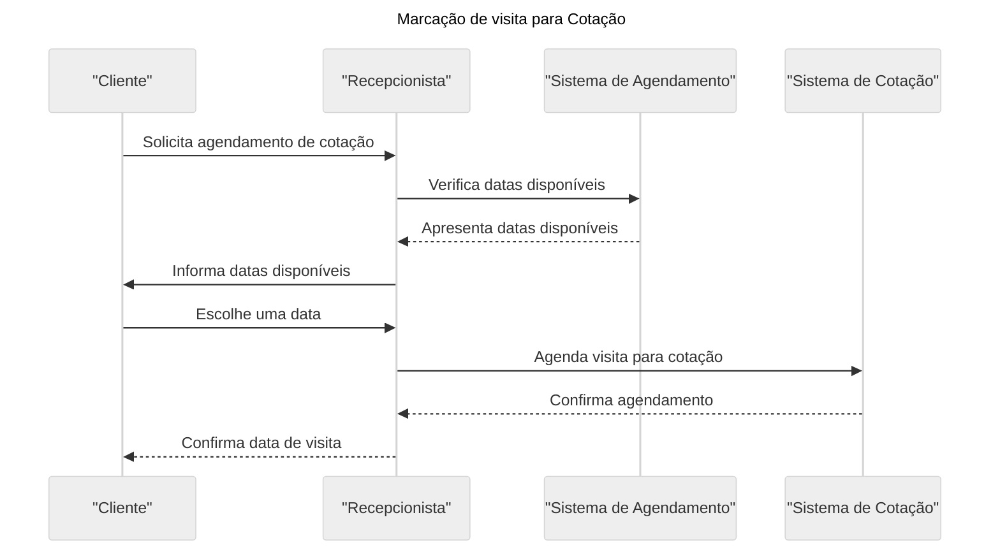
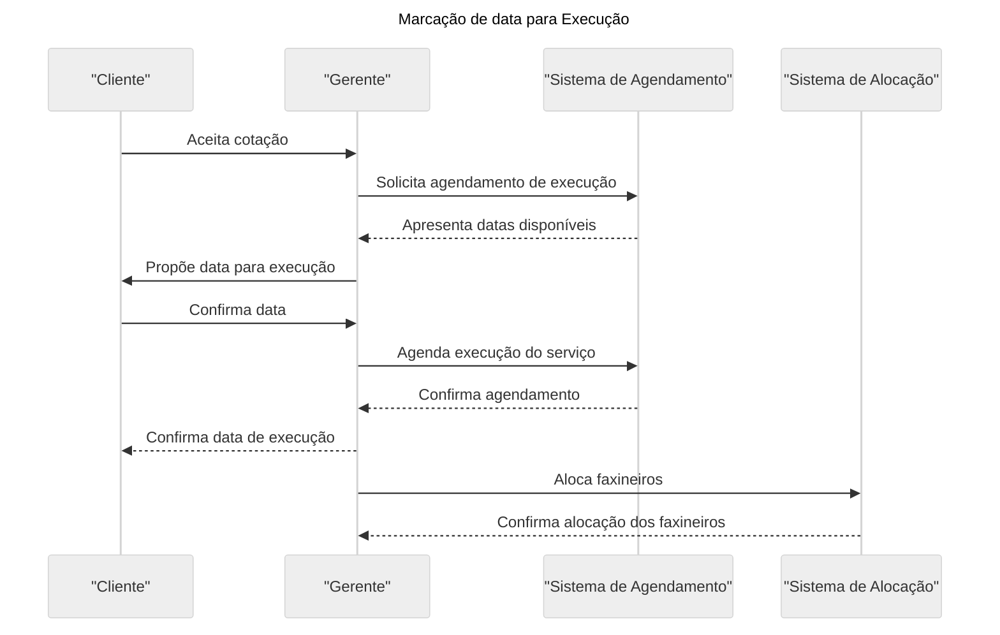

# TP1

O desenvolvimento de software é uma jornada complexa que requer uma abordagem estruturada e metódica para garantir a entrega de produtos de alta qualidade que atendam às necessidades dos usuários. O ciclo de vida do sistema é o conjunto de etapas pelas quais um projeto de software passa, desde a concepção até a implantação e manutenção. Neste trabalho, exploraremos as principais etapas desse ciclo, abordaremos modelos de ciclo de vida tradicionais, focaremos nas fases do desenvolvimento de sistemas orientados a objetos e discutiremos o RUP (Rational Unified Process) e a UML (Linguagem de Modelagem Unificada) em relação ao ciclo de vida do sistema.

O ciclo de vida do sistema compreende várias fases cruciais para garantir o sucesso de um projeto de software. Na abordagem tradicional, as principais etapas incluem a Comunicação (entendimento do problema), Análise e Planejamento (definição de soluções), Design e Modelagem (projeto de software), Implementação (construção do código), Testes (verificação da qualidade) e Implantação (integração em ambiente de produção). O modelo Waterfall, com suas fases sequenciais e sem retorno, e o Modelo Espiral, com iterações incrementais, são exemplos de abordagens tradicionais.

Em contraste, o desenvolvimento de sistemas orientados a objetos enfatiza a criação de soluções através da composição de objetos interconectados. As fases incluem Requisitos (entendimento das necessidades), Design e Análise (criação da estrutura do sistema), Desenvolvimento (implementação dos objetos), Testes (verificação dos componentes) e Instalação (colocação em produção). Essa abordagem oferece flexibilidade e adaptabilidade, permitindo ajustes contínuos conforme as mudanças ocorrem.

O RUP, um processo unificado desenvolvido pela IBM, oferece diretrizes para cada etapa do ciclo de vida do sistema. Ele promove a gestão eficiente de requisitos, o desenvolvimento iterativo, a componentização, a modelagem visual e a verificação da qualidade por meio de testes. A UML, uma ferramenta chave do RUP, permite a representação visual das estruturas e interações do sistema, facilitando a comunicação entre as partes envolvidas no projeto.

Em suma, o ciclo de vida do sistema é uma jornada complexa e estruturada que abrange desde a compreensão do problema até a implantação e manutenção do software. Modelos tradicionais como o Waterfall e o Espiral, juntamente com abordagens orientadas a objetos, oferecem diferentes maneiras de lidar com a complexidade do desenvolvimento de software. O RUP e a UML desempenham papéis cruciais nesse ciclo, garantindo a gestão eficiente de requisitos, a qualidade do software e a comunicação eficaz entre as partes envolvidas. Além disso, a documentação de software desempenha um papel fundamental ao longo do ciclo de vida, garantindo que todas as etapas sejam bem compreendidas e documentadas para futuras referências e manutenções. Em última análise, um ciclo de vida bem planejado e executado contribui para o sucesso e a qualidade dos projetos de software.

---

# TP2/TP3

**Cenários:**

### **Cenário 1: Agendamento e Realização de Limpeza Única**

**Ator Principal:** Cliente

**Descrição:**

1. O cliente entra em contato com a Just the Job para solicitar uma limpeza única em sua propriedade.
2. O atendente da recepção agenda uma visita do gerente de escritório à propriedade do cliente para avaliação.
3. O gerente de escritório visita a propriedade, estima o custo e a data da limpeza, e registra essas informações.
4. Uma vez que o cliente concorda com o custo e a data, um formulário de reserva é preenchido, com uma cópia entregue ao cliente e duas cópias arquivadas no escritório.
5. No dia agendado, uma equipe de dois ou três limpadores realiza a limpeza conforme especificado.
6. O cliente assina uma cópia do formulário de reserva original para confirmar a conclusão satisfatória do trabalho.
7. Quando o formulário de reserva assinado retorna ao escritório, o atendente da recepção emite uma fatura ao cliente pelo pagamento.
8. Uma cópia da fatura quitada é enviada ao cliente após o recebimento do pagamento.

**Cenário Alternativo:**

- Se o cliente não concordar com o custo ou a data da limpeza, o processo é interrompido.

### **Cenário 2: Agendamento e Realização de Limpeza Regular**

**Ator Principal:** Cliente Regular

**Descrição:**

1. Clientes regulares contatam a Just the Job para solicitar serviços de limpeza em uma base semanal.
2. O gerente de escritório negocia uma taxa horária com o cliente regular.
3. A Just the Job designa um limpador para atender o cliente regular no mesmo dia da semana.
4. A limpeza é realizada de acordo com a programação acordada.
5. A Just the Job emite uma fatura mensal para os serviços de limpeza regular.
6. Clientes com serviços de limpeza regular em várias propriedades recebem uma única fatura.

**Lista de Requisitos:**

### **Requisito 1: Gestão de Clientes**

- **Nome:** Gestão de Clientes
- **Descrição:** O sistema deve ser capaz de manter um registro detalhado de todos os clientes, incluindo informações de contato, histórico de limpeza e serviços contratados.
- **Prioridade:** Alta
- **Origem:** Necessidade identificada por Eileen.

### **Requisito 2: Agendamento de Serviços**

- **Nome:** Agendamento de Serviços
- **Descrição:** O sistema deve permitir o agendamento de visitas do gerente de escritório para avaliação e o agendamento de limpezas únicas e regulares.
- **Prioridade:** Alta
- **Origem:** Entradas manuais dos atendentes e negociação com os clientes.

### **Requisito 3: Geração de Faturas**

- **Nome:** Geração de Faturas
- **Descrição:** O sistema deve ser capaz de gerar faturas automaticamente com base nas informações das reservas e dos serviços prestados, incluindo a diferenciação entre limpezas únicas e regulares.
- **Prioridade:** Alta
- **Origem:** Dados das reservas e dos serviços prestados.

### **Requisito 4: Geração de Cronograma Semanal**

- **Nome:** Geração de Cronograma Semanal
- **Descrição:** O sistema deve gerar um cronograma semanal para cada limpador, indicando os locais e horários de trabalho. Esse cronograma será fornecido aos limpadores no início da semana.
- **Prioridade:** Média
- **Origem:** Dados das reservas e atribuição de limpadores.

### **Requisito 5: Acompanhamento de Horas Trabalhadas**

- **Nome:** Acompanhamento de Horas Trabalhadas
- **Descrição:** O sistema deve acompanhar e registrar o número de horas trabalhadas por cada limpador a cada semana.
- **Prioridade:** Média
- **Origem:** Registros dos limpadores.

### **Requisito 6: Gestão de Agendamentos da Gerente**

- **Nome:** Gestão de Agendamentos da Gerente
- **Descrição:** O sistema deve permitir que a gerente de escritório acompanhe seus próprios agendamentos e gere um cronograma pessoal.
- **Prioridade:** Baixa
- **Origem:** Entradas da gerente de escritório.

**Diagrama de Casos de Uso:**

!https://prod-files-secure.s3.us-west-2.amazonaws.com/80a8d215-d876-499b-9a27-b7753eba6567/869cd7b2-9f75-4a08-a2ca-71bc9651a3d8/Untitled.png

**Descrições de Casos de Uso:**

### **Caso de Uso 1: Agendar Visita para Avaliação**

**Ator Principal:** Atendente da Recepção

**Descrição:**

1. Atendente da recepção agenda uma visita do gerente de escritório à propriedade do cliente para avaliação.
2. Este caso de uso envolve a criação e o registro de uma nova reserva no sistema.
3. O cliente fornece informações sobre a propriedade a ser limpa, como tamanho, tipo de limpeza necessária e datas de preferência.

### **Caso de Uso 2: Agendar Limpeza Única**

**Ator Principal:** Atendente da Recepção

**Descrição:**

1. Atendente da recepção agenda uma limpeza única com base nas informações da visita de avaliação e nas preferências do cliente.
2. O sistema registra a reserva para a limpeza.
3. O cliente fornece informações adicionais sobre a limpeza única, como data, horário e serviços a serem prestados.

### **Caso de Uso 3: Agendar Limpeza Regular**

**Ator Principal:** Atendente da Recepção

**Descrição:**

1. Atendente da recepção agenda serviços de limpeza regulares para clientes que solicitam limpezas recorrentes.
2. O sistema mantém um registro das programações de limpeza regulares.
3. O cliente fornece informações sobre a limpeza regular, como frequência, datas e serviços a serem prestados.

### **Caso de Uso 4: Realizar Limpeza**

**Ator Principal:** Equipe de Limpadores

**Descrição:**

1. A equipe de limpadores realiza a limpeza da propriedade de acordo com as especificações da reserva.
2. Após a conclusão, o cliente assina o formulário de reserva, e uma cópia é enviada de volta ao escritório.

### **Caso de Uso 5: Emitir Fatura Única**

**Ator Principal:** Atendente da Recepção

**Descrição:**

1. Atendente da recepção emite uma fatura para o cliente após a conclusão bem-sucedida de uma limpeza única.
2. Uma cópia da fatura é enviada ao cliente após o recebimento do pagamento.

### **Caso de Uso 6: Emitir Fatura Mensal**

**Ator Principal:** Atendente da Recepção

**Descrição:**

1. Atendente da recepção emite faturas mensais para os clientes com serviços de limpeza regular.
2. Os clientes que têm serviços regulares em várias propriedades recebem uma única fatura.

### **Caso de Uso 7: Gerar Cronograma Semanal**

**Ator Principal:** Gerente de Escritório

**Descrição:**

1. Gerente de escritório gera um cronograma semanal para cada limpador, indicando os locais e horários de trabalho.
2. Este cronograma é entregue aos limpadores no início da semana.

### **Caso de Uso 8: Acompanhar Horas Trabalhadas**

**Ator Principal:** Limpador

**Descrição:**

1. Limpadores registram o número de horas trabalhadas a cada semana no sistema.
2. Esses registros são usados para calcular os salários e manter registros precisos.

### **Caso de Uso 9: Gerenciar Clientes**

**Ator Principal:** Gerente de Escritório

**Descrição:**

1. Gerente de escritório pode gerenciar informações de clientes, incluindo detalhes de contato, histórico de limpeza e serviços contratados.
2. Isso inclui adicionar, atualizar e remover informações de clientes.

### **Caso de Uso 10: Gerenciar Agendamentos da Gerente**

**Ator Principal:** Gerente de Escritório

**Descrição:**

1. Gerente de escritório pode gerenciar seus próprios agendamentos e gerar um cronograma pessoal.
2. Isso inclui adicionar, atualizar e remover agendamentos pessoais.

Espero que essas correções estejam de acordo com o que você precisava. Se houver mais alguma coisa que você gostaria de ajustar, por favor, me informe.

---

# TP4/TP5

### Dicionário de Dados

1. **Cliente**
    - **Atributos:**
        - Nome (String)
        - Endereço (String)
        - Telefone (String)
        - Email (String)
        - Histórico de Limpeza (Lista de registros de limpezas anteriores)
        - Serviços Contratados (Lista de serviços de limpeza agendados)
    - **Relações:**
        - N/A
2. **Atendente da Recepção**
    - **Atributos:**
        - Nome (String)
        - ID (String)
        - Função (String)
    - **Relações:**
        - N/A
3. **Gerente de Escritório**
    - **Atributos:**
        - Nome (String)
        - ID (String)
        - Função (String)
    - **Relações:**
        - N/A
4. **Faxineiro (Limpador)**
    - **Atributos:**
        - Nome (String)
        - ID (String)
        - Horas Trabalhadas (Lista de registros de horas trabalhadas)
    - **Relações:**
        - Locais de Trabalho (Lista de locais onde o faxineiro está alocado)
5. **Reserva**
    - **Atributos:**
        - Data (Data)
        - Hora (Hora)
        - Serviço (String)
        - Custo (Float)
    - **Relações:**
        - Cliente (Cliente que fez a reserva)
        - Fatura (Fatura associada à reserva)
6. **Fatura**
    - **Atributos:**
        - Data de Emissão (Data)
        - Valor Total (Float)
        - Itens da Fatura (Lista de itens da fatura)
    - **Relações:**
        - Cliente (Cliente associado à fatura)
        - Reservas (Reservas incluídas na fatura)
7. **Item da Fatura**
    - **Atributos:**
        - Descrição (String)
        - Preço Unitário (Float)
        - Quantidade (Int)
        - Valor Total (Float)
    - **Relações:**
        - Fatura (Fatura à qual o item pertence)
8. **Cronograma Semanal**
    - **Atributos:**
        - Semana (Data)
    - **Relações:**
        - Faxineiro (Faxineiro alocado na semana)
        - Locais de Trabalho (Lista de locais onde o faxineiro está alocado na semana)
9. **Local de Trabalho**
    - **Atributos:**
        - Nome (String)
        - Endereço (String)
        - Horário (Hora)
    - **Relações:**
        - Faxineiro (Faxineiro alocado no local de trabalho)

### Diagrama de Objetos

```sql
+-----------------+          +-----------------+         +-----------------+
|     Cliente     |          | Atendente da    |         |    Gerente      |
+-----------------+          | Recepcao        |         +-----------------+
| - Nome: String  |          +-----------------+         | - Nome: String  |
| - Endereço:     |          | - Nome: String  |         | - ID: String    |
|   String        |          | - ID: String    |         | - Função: String|
| - Telefone:     |          | - Função:String |         +-----------------+
|   String        |          +-----------------+                  |
| - Email: String |                                               |
| - Histórico de  |                                               |
|   Limpeza: Lista|                                               |
| - Serviços      |                                               |
|   Contratados:  |                                               |
|   Lista de      |                                               |
|   Reservas:Lista|                                               |
+-----------------+                                      +-----------------+
         |                                               |    Faxineiro    |
         |                                               +-----------------+
+-----------------+                                      | - Nome: String  |
|     Limpador    |                                      | - ID: String    |
+-----------------+                                      | - Horas         |
| - Nome: String  |                                      |   Trabalhadas:  |
| - ID: String    |                                      |   Lista de      |
| - Horas         |                                      |   horas         |
|   Trabalhadas:  |                                      +-----------------+
|   Lista de      |                                               |
|   horas         |                                               |
+-----------------+                                      +-----------------+
         |                                               |     Reserva    |
+-----------------+                                      +-----------------+
|     Fatura      |                                      | - Data: Data    |
+-----------------+                                      | - Hora: Hora    |
| - Data de       |                                      | - Serviço:      |
|   Emissão:      |                                      |   String        |
|   Data          |                                      | - Custo: Float  |
| - Valor Total:  |                                      +-----------------+
|   Float         |                                               |
| - Itens da      |                                      +-----------------+
|   Fatura: Lista |                                      |     Fatura      |
+-----------------+                                      +-----------------+
         |                                               | - Data de       |
         |                                               |   Emissão:      |
+-----------------+                                      |   Data          |
| Item da Fatura  |                                      | - Valor Total:  |
+-----------------+                                      |   Float         |
| - Descrição:    |                                      | - Itens da      |
|   String        |                                      |   Fatura: Lista |
| - PreçoUnitário:|                                      +-----------------+
|   Float         |                                               |
| - Quantidade:   |                                      +-----------------+
|   Int           |                                      | Item da Fatura  |
| - Valor Total:  |                                      +-----------------+
|   Float         |                                      | - Descrição:    |
+-----------------+                                      |   String        |
         |                                               | - PreçoUnitário:|
         |                                               |   Float         |
+-----------------+                                      | - Quantidade:   |
| Cronograma      |                                      |   Int           |
| Semanal         |                                      | - Valor Total:  |
+-----------------+                                      |   Float         |
| - Semana: Data  |                                      +-----------------+
| - Limpador:     |                                               |
|   Limpador      |                                      +-----------------+
| - Locais de     |                                      |   Cronograma    |
|   Trabalho:Lista|                                      |   Semanal       |
+-----------------+                                      +-----------------+
         |                                               | - Semana: Data  |
         |                                               | - Limpador:     |
+-----------------+                                      |   Limpador      |
| Local de        |                                      | - Locais de     |
| Trabalho        |                                      |   Trabalho:Lista|
+-----------------+                                      +-----------------+
| - Nome: String  |                                      
| - Endereço:     |                
|   String        |                
| - Horário: Hora |                
+-----------------+                 
```

Por exemplo:


```xml
@startuml
object "Cliente" as C {
Nome: "João Silva"
Endereço: "Rua das Flores, 123"
Telefone: "(11) 98765-4321"
Email: "joao@email.com"
Histórico de Limpeza: "[...]"
Serviços Contratados: "[...]"
}

object "Atendente da Recepcao" as A {
Nome: "Maria"
ID: "A001"
Função: "Atendente"
}

object "Gerente de Escritorio" as G {
Nome: "Carlos"
ID: "G001"
Função: "Gerente"
}

object "Faxineiro" as F {
Nome: "Roberto"
ID: "F001"
Horas Trabalhadas: "[...]"
}

object "Reserva" as R {
Data: "10/10/2023"
Hora: "14:00"
Serviço: "Limpeza Completa"
Custo: "R$ 150,00"
}

object "Fatura" as Fa {
Data de Emissão: "01/10/2023"
Valor Total: "R$ 150,00"
Itens da Fatura: "[...]"
}

object "Item da Fatura" as I {
Descrição: "Limpeza Completa"
Preço Unitário: "R$ 150,00"
Quantidade: "1"
Valor Total: "R$ 150,00"
}

object "Cronograma Semanal" as CS {
Semana: "04/10/2023 - 10/10/2023"
}

object "Local de Trabalho" as L {
Nome: "Escritório Central"
Endereço: "Av. Central, 456"
Horário: "08:00 - 18:00"
}
@enduml
```

# Teste de Performance 5

**Diagrama de Classes**: apresentando todas as classes de domínio, apresentando também os seus atributos e as relações com outras classes, caso haja.


```xml
@startuml
class Cliente {
+Nome: String
+Endereco: String
+Telefone: String
}

class Recepcionista {
+Nome: String
+ID: Int
}

class Gerente {
+Nome: String
+ID: Int
}

class Faxineiro {
+Nome: String
+ID: Int
+HorasTrabalhadas: Int
}

class Servico {
+Descricao: String
+Preco: Float
}

class Cotacao {
+Data: Date
+Valor: Float
}

class Fatura {
+DataEmissao: Date
+ValorTotal: Float
}

class Agenda {
+Data: Date
+Atividades: String
}

Cliente "1" -- "n" Cotacao : Solicita
Recepcionista "1" -- "n" Cotacao : Realiza
Gerente "1" -- "n" Fatura : Emite
Gerente "1" -- "1" Agenda : Possui
Faxineiro "1" -- "n" Servico : Realiza
@enduml
```

---

# TP6/TP7

[TP6 - Diagrama de Estado] Apresentando todos os estados da classe Ordem de Serviço, apresentando também os eventos que alternam a classe entre os seus estados. Identifique também, quando houver, ações e eventos temporais. Não esqueça de apresentar as condições de guarda dos eventos, caso haja.



[TP7 - Diagramas de Sequência] Apresentando todos os objetos e as trocas de mensagens para cada um dos dois cenários solicitados.

### ****Marcação de visita para Cotação****



### ****Marcação de data para Execução****


